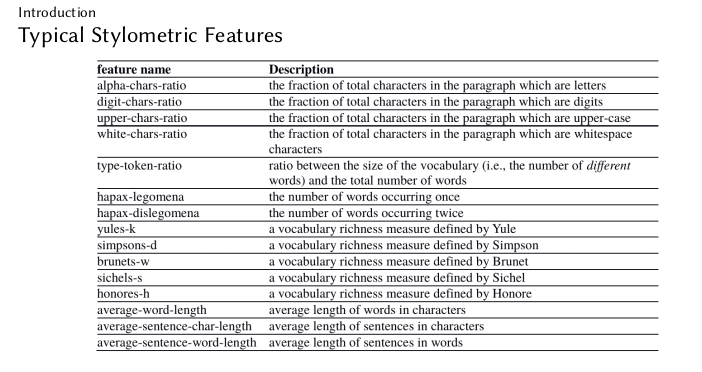

# Natural Language Processing SS 2022
Natural language processing


``` Download stopwords first in preprocessing```


## Tasks

### Preprocessing of data

`preprocessing/preprocessing.py`

- functions for
  - POS tagging
  - tokenization
  - lemmatization
  - stopwords removal


### Vectorization of data
vectorization is the process to converting text into numerical representation, which then can be used for ML

- Types:
  - Bag Of Words
  - Word2Vec
  - Normalized TF-IDF


## Ideen

Clasification Task

Classes are Users
### Features

- average comment length
- #stopwords
- lowercase / upcase writing style
- TF-IDF
- Phrasen (sentiwordnet)
- Triggered Categories (which topics does the user write comments)
- stylometric features (see stylometry)
- sentiment detaction (positive / negative comments) \



## TODO
1) SQL query schreiben, dass wir alle user sortiert mit allen kommentare bekommen
2) 1x mit Metadata (created_at, ..) und 1x ohne. Dann im report das vergleichen

UserID | commentare | created at
-------- |------------| --------
User1   | comment1   | yy
User1   | comment2   | 3
User2   | comment1   | yy
User2   | comment2   | 3
User3   | comment1   | yy
User3   | comment2   | 3
..   | ..         | ..


  

3) für jeden User alle kommentare nehmen und features generieren - siehe features
4) am ende Feature matrix
      

UserID | feature 2 | feature 3
-------- |-----------| --------
User1   | xxx       | yy
User2   | xx        | 3

5) ML model aufsetzen - verschiedene models probieren